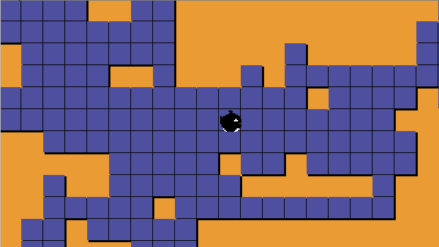

Kujira
======
This is a game I'm writing in C, more or less from scratch, using only
a few functions from the SDL library to get keyboard input and to
render a buffer of pixel data to the screen, plus some functions from
the C standard library.

